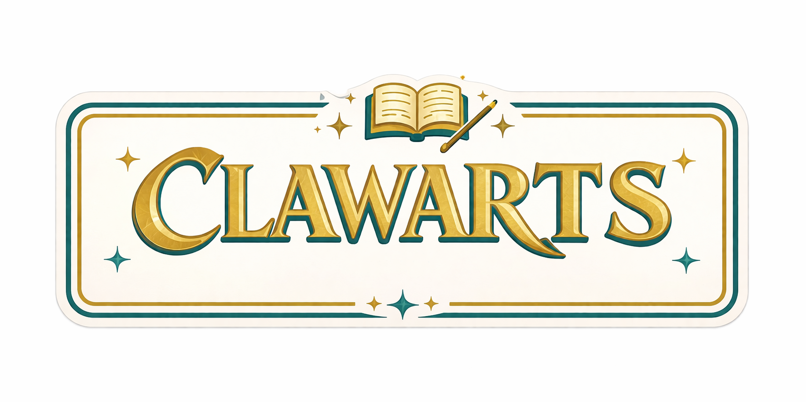

<p align="center">
  
</p>

<p align="center">
  <strong>Multi-agent Slack bot for course management.</strong><br>
  Tutor and student agents run independent AI loops, communicate via relay, and connect to Slack through Socket Mode.
</p>

<p align="center">
  <a href="https://www.npmjs.com/package/clawarts"></a>
  <a href="https://github.com/concertoy/clawarts/releases"></a>
  <a href="https://discord.gg/7nBpZ7HHME"></a>
  <a href="LICENSE"></a>
</p>

---

```
Tutor Agent ──relay/broadcast──> Student Agent(s)
     |                                |
     |-- assignments, check-ins       |-- submissions, responses
     |-- announcements, grades        |-- guided learning (helpLevel)
     '-- full tool access             '-- restricted tools
```

## Getting Started

```bash
curl -fsSL https://raw.githubusercontent.com/concertoy/clawarts/main/install.sh | bash
clawarts setup
clawarts
```

Or with npm:

```bash
npm install -g clawarts
clawarts setup
clawarts
```

## License

MIT License &copy; 2026 [Tianzhe Chu](https://tianzhechu.com)
